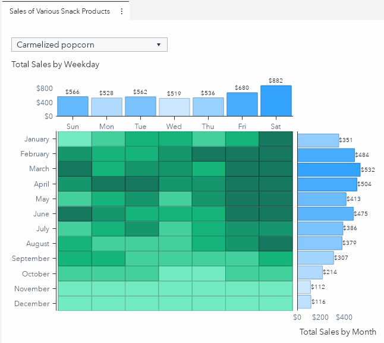

Did you know that you can use the graph builder to create a single graph that has multiple elements side by side?  This uncommonly used feature allows developers to create interactive custom graphs that combine the power of multiple graph elements, all rolled into one!  For example, I like heatmaps and bar charts for different reasons.  Heat maps are great at showing values for two data items by using a table with colored cells.  Bar charts can display a data item's total values via the height of its bars. These two graph types each have unique ways of displaying data.  And if I could combine their powers into one interactive graph, now that would really be something! 

One way to achieve this is to use the Graph Builder to combine a heat map and two bar charts into a single graph!  Using the Graph Builder and the sashelp library's snacks data set, I was able to create the following report which shows the total sales of snacks by month and year:

<!---Get the details on the graph's source data and how to re-create this chart in this SAS Communities Library [article](https://communities.sas.com/t5/SAS-Communities-Library/Three-steps-to-building-a-bubble-plot-with-guidelines/ta-p/577432).--->

This branch contains the needed resources to recreate this custom graph including:
* The code to which creates the final barChartHeatmap data set - barChartHeatmap_ETL.sas
* A JSON file containing the completed custom graph - barChartHeatmap_CG.json
* A JSON file containing the completed report - barChartHeatmap.json
