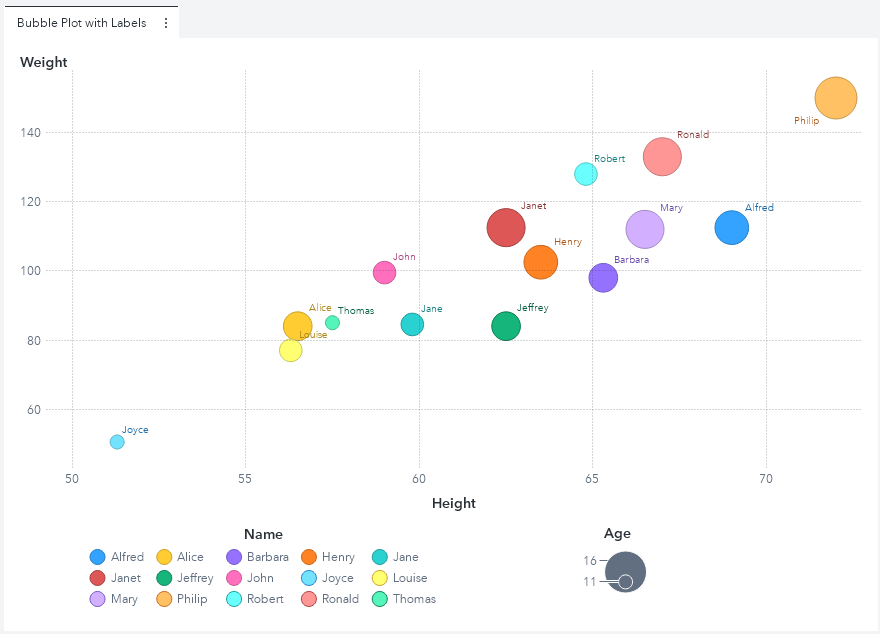

I'm always looking for ways to make my Visual Analytics reports better. Sometimes, just a small change can greatly improve a report's usefulness and readability.

For example, if you have a standard bubble plot with several bubbles on it, continually referencing the graph's legend colors in coordination with the bubbles colors can be challenging.  Wouldn't it be easier if we could place a data label label next to each bubble? Well guess what? Using the graph builder, you can! By making just a few small changes to the standard bubble plot, I was able to create this version of the graph:

Get the details on the graph's source data and how to re-create this chart in this SAS Communities Library [article](https://communities.sas.com/t5/SAS-Communities-Library/How-Upgrade-Your-VA-Bubble-Plots-With-Data-Labels/ta-p/660068).

This directory contains the needed resources to recreate this custom graph including:
* A JSON file containing the completed custom graph - bubblePlotWithLabels_CG.json
* A JSON file containing the completed report - bubblePlotWithLabels.json
