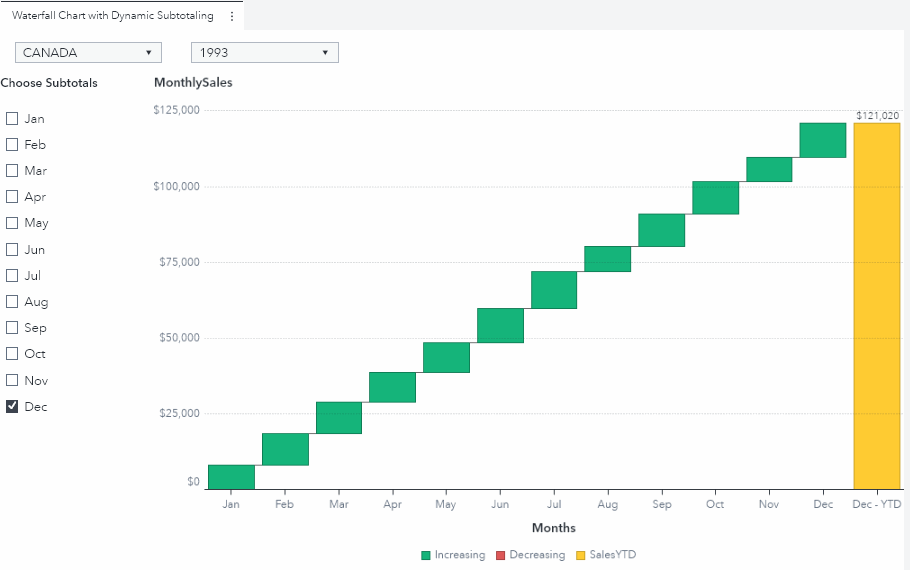

I love using [Waterfall Charts](https://go.documentation.sas.com/doc/en/vacdc/8.5/vaobj/p0ez4c9d26tr3tn1i927bqgz5ei3.htm) in my [SAS® Visual Analytics](https://go.documentation.sas.com/doc/en/vacdc/8.5/vaov/home.htm) reports.  In particular, I think they show very well when they are used to visualize time series data.  The only thing I don't like about them is you can only have one cumulative bar at the end of the graphic.  In fact, it would be really nice if a user could interactively choose where to display cumulative bars in their report's waterfall charts.  

For example, a sales organization might want to know the subtotals of new sales after each quarter of the fiscal year.  Alternatively, someone looking at academic data would want to see the subtotals for their data at the end of the academic year (which might be in June).  This got me thinking, is it possible to give report users the great visual display of a waterfall chart, but also give them the functionality to interactively choose where they would like cumulative bars placed? Well, as it turns out, the answer is yes!  Using the [SAS® Graph Builder](https://go.documentation.sas.com/, I was able to build the report below which has this functionality:

Pretty Neat!  The report above displays sales data sourced from the "prdsale" dataset available in the "SASHELP" library.  SAS also provides this dataset on the [SAS® Viya® Example Data Sets webpage](https://support.sas.com/documentation/onlinedoc/viya/examples.htm). 

The user can first see a waterfall chart that has the standard Final (cumulative) bar at the end of the year.  However, if they wish, they can interactively select one or more months and additional cumulative bars appear!

Get the details on the source data and how to re-create this graph in this SAS Communities Library [article](https://communities.sas.com/t5/SAS-Communities-Library/3-Steps-to-Building-Waterfall-Charts-with-Interactive-Subtotals/ta-p/737704).

This directory contains the needed resources to recreate this custom graph including:
* A JSON file containing the completed custom graph - dynamicTotalWaterfall_CG.json
* A JSON file containing the completed report - WaterfallChartWithDynamicSubtotals.json
* The code which creates the final dynamicTotalWaterfall data set - dynamicTotalWaterfallETL.sas
