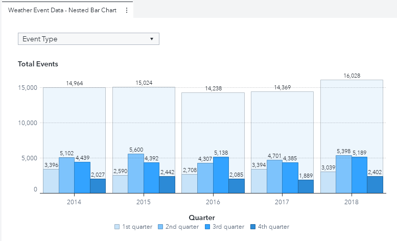

As we make the transition from summer into fall, I've been seeing lots of news stories describing all the storms that are occurring.  Be it hurricanes, thunderstorms, or just heavy rain it seems that this time of year has a lot of weather events.  This got me thinking, what is the distribution of total weather events throughout the year?  Are there more rainstorms in spring or fall?  

To answer this question I decided to create a nested bar chart using the [SAS® Graph Builder](https://go.documentation.sas.com/?cdcId=vacdc&cdcVersion=8.5&docsetId=grbldrug&docsetTarget=titlepage.htm&locale=en) in SAS Viya.  

In just a short time, I was able to create the report below:

Very interesting!  The custom graph allows us to see which quarter (or season) of the year specific weather events happen.  More so, since the visual is a nested bar chart, we have the ability to see the number of events for each quarter as a proportion of the total events for the year.  The data source for the example report above comes from a set of csv files that are available on the [SAS® Viya® Example Data Sets webpage](https://support.sas.com/documentation/onlinedoc/viya/examples.htm) that contain information about weather events.  However, if you do not wish to extract the data from the [SAS® Viya® Example Data Sets webpage](https://support.sas.com/documentation/onlinedoc/viya/examples.htm), there is some simulated data in this directory which can also work in this example.

Get the details on the source data and how to re-create this graph in this SAS Communities Library [article](https://communities.sas.com/t5/SAS-Communities-Library/Three-Steps-to-Building-a-Nested-Bar-Chart/ta-p/682769).

This directory contains the needed resources to recreate this custom graph including:
* Five simulated data sets of weather event data: 
  * d_2014.sas7bdat
  * d_2015.sas7bdat
  * d_2016.sas7bdat
  * d_2017.sas7bdat
  * d_2018.sas7bdat
* The code to which creates the final storms_nestedBarChart data set - storms_nestedBarChart_ETL.sas
* The completed output data set (sourced from the simulated data sets) - storms_nestedBarChart.sas7bdat
* A JSON file containing the completed custom graph - nestedBarChart_GC.json
* A JSON file containing the completed report - nestedBarChart.json

