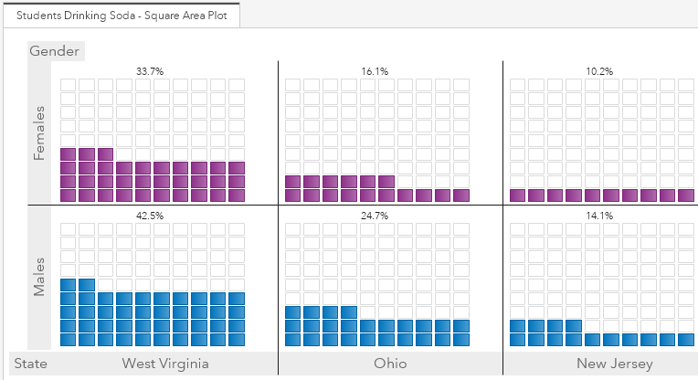

Have you ever had some basic percentage data you needed to create a data visualization from? This can be a difficult task because you only have one metric to work with. For these situations, I'm a big fan of square area plots. Not only because they look cool, but because they offer the ability to turn very basic data and into a slick, informative looking graph!

Get the details on the graph's source data and how to re-create this chart in this SAS Communities Library [article](https://communities.sas.com/t5/SAS-Communities-Library/Three-steps-to-building-a-square-area-plot-in-SAS-Visual/ta-p/557966)

This directory contains the needed resources to recreate this custom graph including:
* The data template needed to create the blocks - sqg_template.sas7bdat
* A simulated source dataset - simulated_soda_data.sas7bdat
* The code to which creates the final soda_percentage data set - square_area_soda_ETL.sas
* The completed output data set (sourced from the simulated data set) - soda_square_area_graph.sas7bdat
* A JSON file containing the completed custom graph - Square_Area_Plot_CG.json
* A JSON file containing the completed report - Square_Area_Plot.json
