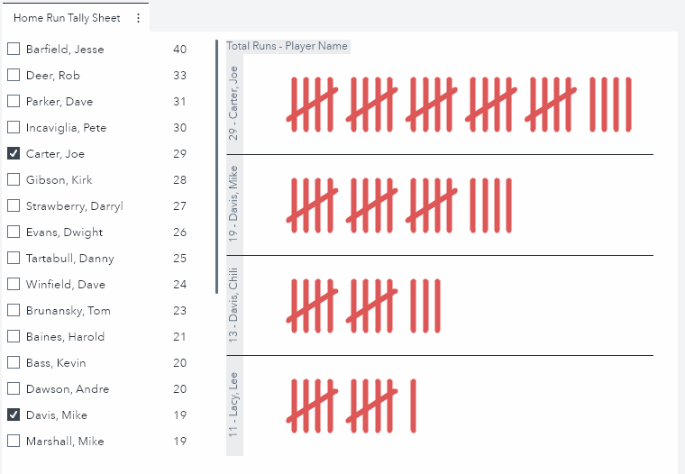

I love to make tally sheets.  Whether I'm trying to remember how many times it snowed over the past few winters or how many glasses of water I've drank each day of the week, there always seems to be a piece of paper in my pocket with a bunch of tally marks on it.  I recently began to wonder why I like making tally sheets so much.  It occurred to me that they are actually a great way to compare data by groups. 

I then began to ask myself if I could build an interactive tally sheet in SAS Visual Analytics?  Well, as it turns out, the answer is yes!  Using a custom graph, I was able to build the report below which contains an interactive tally sheet comparing baseball player's total home runs:

Pretty Neat!  For this report's data source, the "baseball" dataset available in the "SASHELP" library is used.  The source dataset is also provided on the [SAS® Viya® Example Data Sets webpage](https://support.sas.com/documentation/onlinedoc/viya/examples.htm) website.  In this post, I'll outline three steps to recreate this custom graph and report. Let's get started!

<!---Get the details on the source data and how to re-create this graph in this SAS Communities Library [article](https://communities.sas.com/).--->

This directory contains the needed resources to recreate this custom graph including:
* A JSON file containing the completed custom graph - tallyChartGC.json
* A JSON file containing the completed report - tallySheet.json
* The template dataset for creating the tally marks - tallytemplate.sas7bdat
* The code which creates the final baseballTallyChart data set - tallySheetETL.sas
