# Visual Analytics Custom Graph Examples

The SAS Graph Builder enables users to create custom graphs that can be used as a graph object within a SAS Visual Analytics report.  The content here are examples of custom graphs referenced in SAS Communities articles. 

Descriptions, source code and supporting ETL for each custom graph are located in the "Examples" folder subdirectories. 

Additionally each subdirectory contains a README file which links to a communities.sas.com article which will have step-by-step instructions on creating the custom graph yourself. 

## Getting Started

After you have downloaded a custom graph json file from this repository, you will need to import it into your SAS Visual Analytics environment.  Instructions on how to import it are located [here](https://go.documentation.sas.com/?docsetId=vaobj&docsetTarget=n1nixuwj79bthfn15ew5dqldpcis.htm&docsetVersion=8.3&locale=en).

With the graph successfully imported, you can [add it to a new or existing SAS Visual Analytics report](https://go.documentation.sas.com/?docsetId=vaobj&docsetTarget=n1nixuwj79bthfn15ew5dqldpcis.htm&docsetVersion=8.3&locale=en).

### Examples

Some examples of this repository's custom graphs and their respectice SAS Communities articles are below:

*  Calendar Heatmap Matrix
    * [SAS Communities article](https://communities.sas.com/t5/SAS-Communities-Library/Three-Steps-to-Building-a-Calendar-Heatmap-Matrix/ta-p/520854)
    * [Repository location](./Examples/calendar-heatmap-matrix/)

    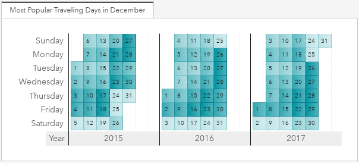

*  US Map TileChart
    * [SAS Communities article](https://communities.sas.com/t5/SAS-Communities-Library/3-steps-to-build-a-US-map-tile-chart-in-SAS-Visual-Analytics/ta-p/539108)
    * [Repository location](./Examples/US-map-tile-chart)

    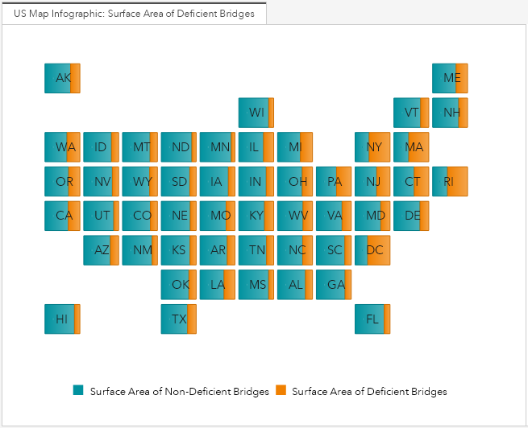    

*  Monthly Temperature Comparison Strip Plot
    * [SAS Communities article](https://communities.sas.com/t5/SAS-Communities-Library/3-steps-to-building-a-monthly-temperature-strip-plot/ta-p/600800)
    * [Repository location](./Examples/Strip-Plot)

    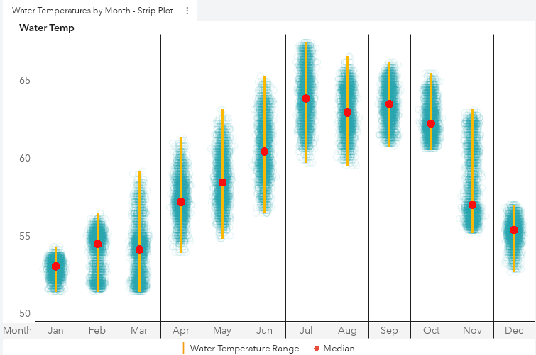  

*  Air Temperature Circle Graph
   * [SAS Communities article](https://communities.sas.com/t5/SAS-Communities-Library/3-Steps-to-Building-an-Air-Temperature-Circle-Graph/ta-p/620899)    
    * [Repository location](./Examples/airTempCircleGraph)

    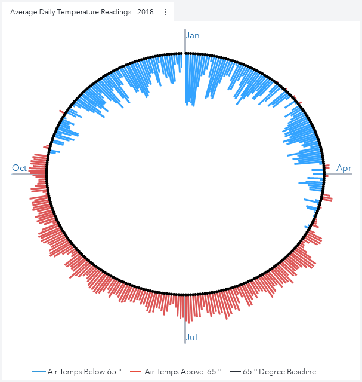  
    

*  Square Area Plot
   * [SAS Communities article](https://communities.sas.com/t5/SAS-Communities-Library/Three-steps-to-building-a-square-area-plot-in-SAS-Visual/ta-p/557966)    
    * [Repository location](./Examples/square_area_plot)

      

*  Trend Comparison Line Plot
    * [SAS Communities article](https://communities.sas.com/t5/SAS-Communities-Library/3-steps-to-build-a-trend-comparison-line-plot-in-SAS-Visual/ta-p/533266)
    * [Repository location](./Examples/Comparing-yearly-trends)

    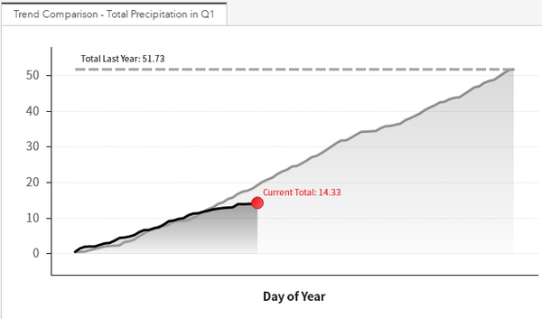  
    
*  Butterfly Line Chart
    * [SAS Communities article](https://communities.sas.com/t5/SAS-Communities-Library/How-to-create-a-butterfly-line-chart-in-SAS-Visual-Analytics/ta-p/489398)
    * [Repository location](./Examples/butterfly-line-chart)
    
    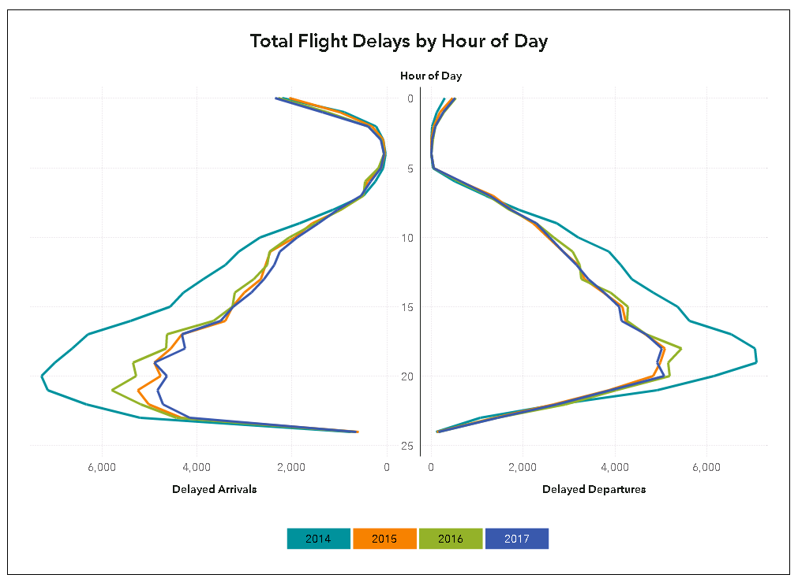
    
*  Comparing Two Metrics 
    * [SAS Communities article](https://communities.sas.com/t5/SAS-Communities-Library/Comparing-similar-metrics-using-SAS-Visual-Analytics-custom/ta-p/507005)
    * [Repository location](./Examples/comparing-two-metrics)

    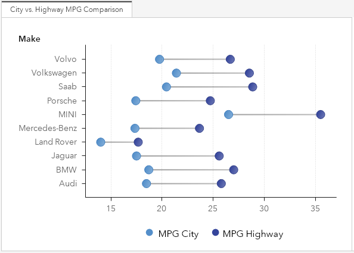      
    
*  Displaying Individual Data Values Within A Range 
    * [SAS Communities article](https://communities.sas.com/t5/SAS-Visual-Analytics-Gallery/Displaying-Individual-Data-Values-And-Labels-Within-A-Range/ta-p/565417)
    * [Repository location](./Examples/Display_Values_in_a_Range)

    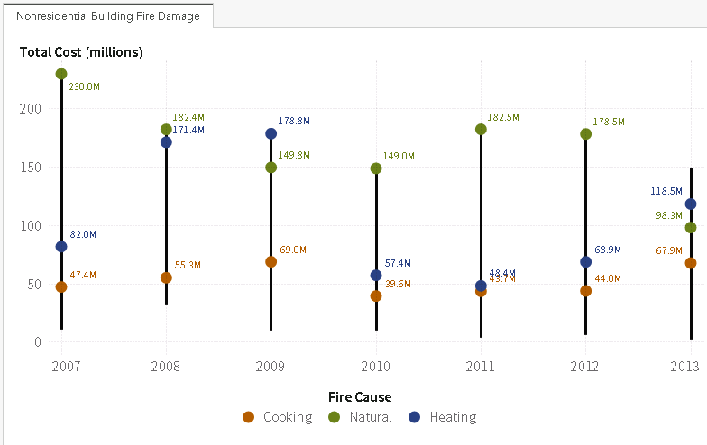          
    
*  Creating Custom Labels
    * [SAS Communities article](https://communities.sas.com/t5/SAS-Communities-Library/3-steps-to-label-specific-data-points-in-SAS-Visual-Analytics/ta-p/505057)
    * [Repository location](./Examples/creating_custom_labels)

    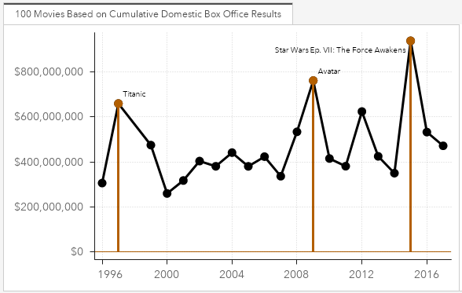          
    
*  Comparing Ranks Over Time
    * [SAS Communities article](https://communities.sas.com/t5/SAS-Communities-Library/Ranking-states-by-turkey-production-using-SAS-Visual-Analytics/ta-p/514552)
    * [Repository location](./Examples/Yearly-Ranking-Graph)

        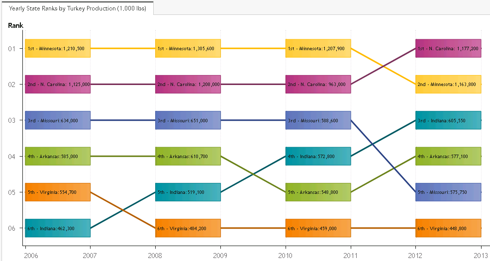
    
*  Monthly Temperature Comparison Chart
    * [SAS Communities article](https://communities.sas.com/t5/SAS-Communities-Library/3-steps-to-building-a-monthly-temperature-comparison-chart/ta-p/544702)
    * [Repository location](./Examples/water_temp_comparison)

    
    
*  Temperature Range Vector Plot
    * [SAS Communities article](https://communities.sas.com/t5/SAS-Communities-Library/Is-summer-over-already-Time-to-create-a-custom-vector-plot-in/ta-p/231253)
    * [Repository location](./Examples/Temperature_Range_Vector_Plot)

    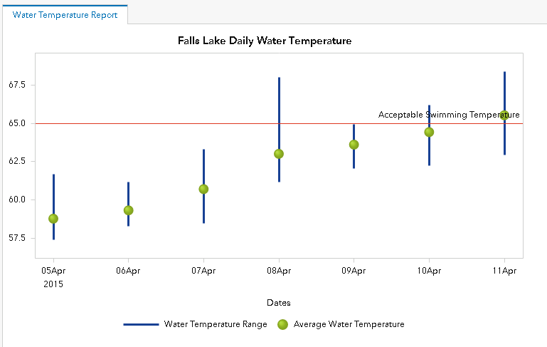

*  Four Measure Bar Chart
    * [SAS Communities article](https://communities.sas.com/t5/SAS-Communities-Library/How-to-place-4-measures-on-the-same-SAS-Visual-Analytics-graph/ta-p/226336)
    * [Repository location](./Examples/FourMeasureBarChart)

    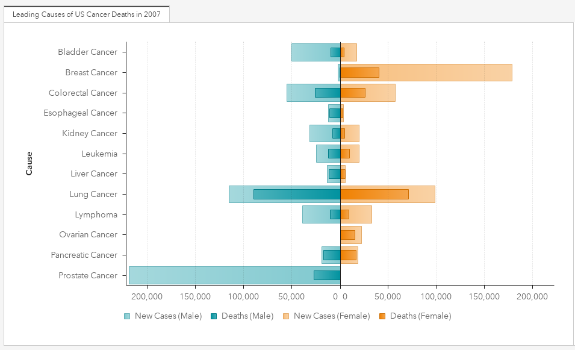
    
*  Bubble Plot with Guidelines
    * [SAS Communities article](https://communities.sas.com/t5/SAS-Communities-Library/Three-steps-to-building-a-bubble-plot-with-guidelines/ta-p/577432)
    * [Repository location](./Examples/ScatterPlotGuidelines)

    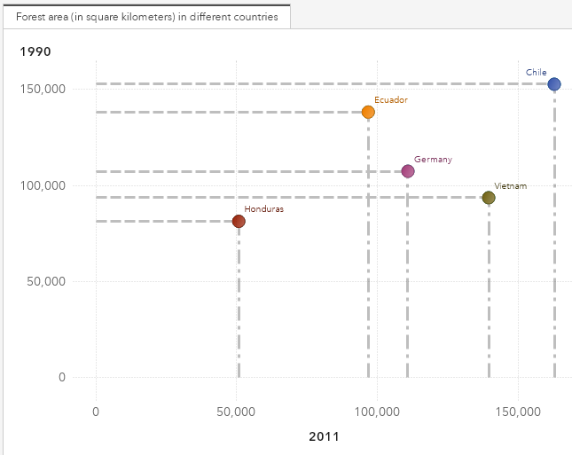    

*  Adding Standard Deviation Error Bars to a Bar Chart
    * [SAS Communities Gallery post](https://communities.sas.com/t5/SAS-Communities-Library/3-steps-to-label-specific-data-points-in-SAS-Visual-Analytics/ta-p/505057)
    * [Repository location](./Examples/BarChartErrorBars)

    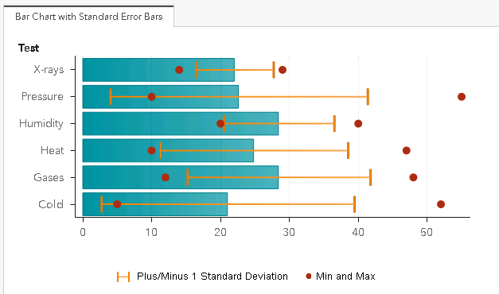  

## Contributing

We welcome your contributions! Please read [CONTRIBUTING.md](CONTRIBUTING.md) for details on how to submit contributions to this project.

## License

This project is licensed under the [Apache 2.0 License](LICENSE).

## Additional Resources
* [SAS Graph Builder 8.5: User’s Guide](https://go.documentation.sas.com/?cdcId=vacdc&cdcVersion=8.5&docsetId=grbldrug&docsetTarget=titlepage.htm&locale=en)
* [SAS Graph Builder 8.3: User’s Guide](https://go.documentation.sas.com/api/docsets/grbldrug/8.3/content/grbldrug.pdf)
* [SAS Visual Analytics 7.1: Creating and Using Custom Graph Objects ](http://support.sas.com/documentation/cdl/en/vaug/67500/HTML/default/viewer.htm#n1dk184ptuhv5zn1dx3iqjeu3h1p.htm)

